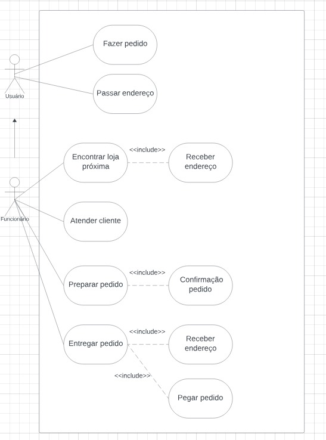
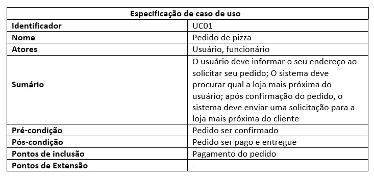
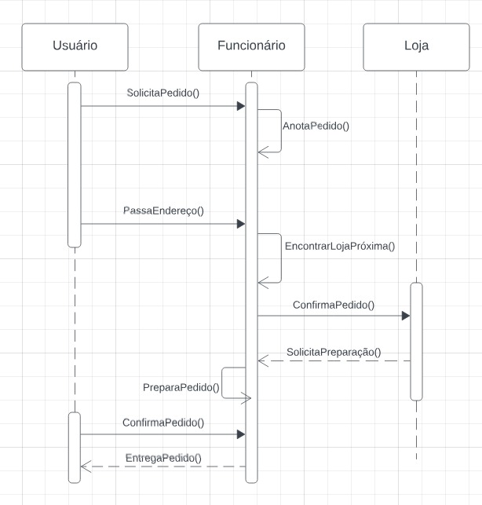
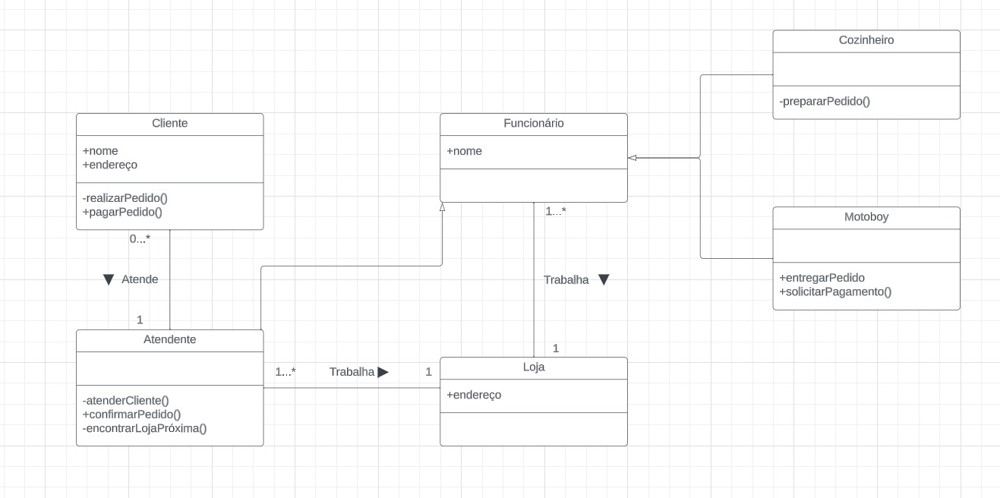
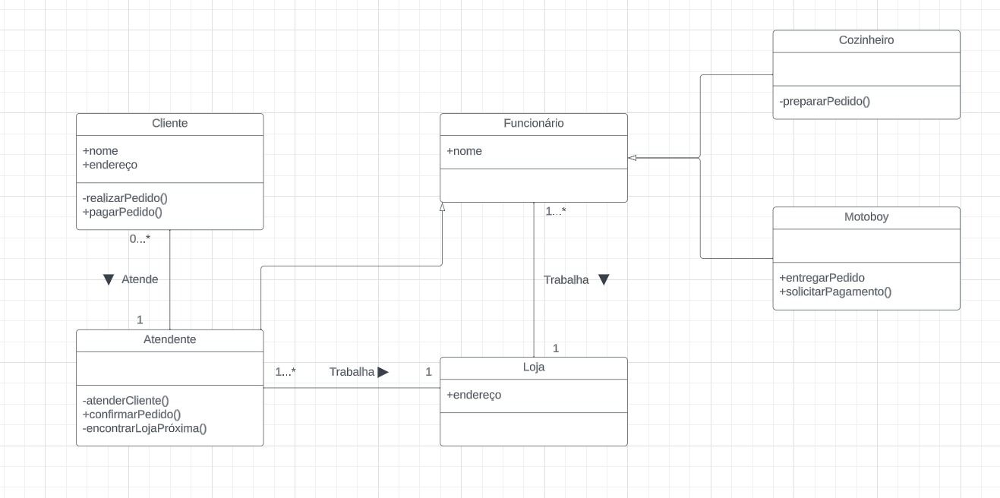
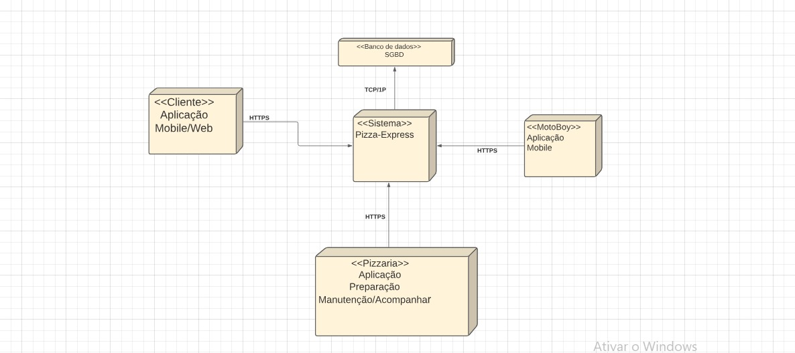

<h2><a href= "https://www.mackenzie.br">Universidade Presbiteriana Mackenzie</a></h2>
<h3><a href= "https://www.mackenzie.br/graduacao/sao-paulo-higienopolis/sistemas-de-informacao">Sistemas de Informação</a></h3>

*&lt;Projeto NTP  -  Pizza-Express&gt;*

**Conteúdo**

- [Autores](#autores)
- [Descrição do Projeto](#descrição-do-projeto)
- [Análise de Requisitos](#análise-de-requisitos)
- [Diagrama de Casos de Usos](#diagrama-de-casos-de-usos)
- [Descrição dos Requisitos no Casos de Uso](#descrição-dos-requisitos-no-casos-de-uso)
- [Diagrama de Sequência](#diagrama-de-sequência)
- [Diagrama de Classes](#diagrama-de-classes)
- [Diagrama de Componentes](#diagrama-de-componentes)
- [Decisão da Arquitetura](#decisão-de-arquitetura)
- [Diagrama de Implantação](#diagrama-de-implantação)
- [Referências](#referências)

# Autores

* Allan Cardoso dos Santos -  TIA: 32361815
* Fernando Morales Peres   -  TIA: 32349459
* Lucas Delsoci Cardoso    -  TIA: 32331169
* Paola Polito             -  TIA: 32329687

# Descrição do Projeto

*&lt;Contexto da História (Problema ou Demanda)

A Pizza-Express é uma cadeia de 40 lojas de fast-food e entrega em casa.

Pizza-Express tem perdido recentemente 30% do rendimento de vendas devido a um problema em seu negócio da entrega. Atribuem este problema a seu concorrente principal que promoveu um programa que garante o serviço de entrega em 30 minutos, desde a entrada da ordem de serviço até a entrega na casa do cliente (delivery).

Pizza-Express anuncia a entrega em uma hora.

Pizza-Express usa atualmente computadores para armazenar as operações e as funções usuais do negócio, mas não auxiliam nas funções para processar a entrega dos pedidos dos seus clientes.

Elonn Muske, o gerente de sistemas de informação é o encarregado para desenvolver uma aplicação do software para identificar a localização de lojas de pizza Pizza-Express mais próxima do cliente e para criar o sistema de software necessário para operá-las.

O patrocinador deste projeto, a empresa Papa-Léguas Delivery, disse que o futuro da Pizza-Express depende deste projeto.

A equipe deverá investigar uma opção para entregar a pizza em menos de 30 minutos.

A sua idéia é montar lojas de pizza Pizza-Express que não teriam nenhum espaço de varejo, pois a sua função é somente receber ordens, preparar e entregar as pizzas.

A loja deverá ser localizada o mais próximo do cliente receberá a ordem através de uma central, processará, e entregará a ordem dentro de 10 ou 15 minutos da entrada do pedido.

Há dois projetos do desenvolvimento do software identificados aqui:

primeiro é um sistema de software para o atendimento do pedido e para encontrar localização da fábrica da pizza mais próxima do cliente para fazer a entrega; e
segundo é um sistema de software para suportar operações da fábrica de pizzas.
Importante: Dá equipe se exigem profissionalismo e colaboração mútua.&gt;*

# Análise de Requisitos
*&lt; O sistema identificado na descrição do projeto é um sistema que identifica a localização da loja mais próxima do cliente para uma rápida entrega. Para isso e necessário que o sistema, com base no endereço enviado pelo cliente, procure a loja mais próxima de tal endereço por meio de um sistema de proximidade. Anexado à implementação anterior, logo após encontrar a loja mais próxima do cliente, uma solicitação deve ser enviada à pizzaria e logo após decisão do pedido, enviar sua descrição, afim da cozinha começar a preparar o pedido logo após sua confirmação.
	O sistema deve ser rápido e simples para que não haja complicações no momento de sua execução. Além disso, devemos contar com um bom trabalho eficiente em equipe dos funcionários que atuam na cozinha pra que o pedido seja feito rápido e consequentemente entregue sem demora.
 &gt;*

# Diagrama de Casos de Usos

*&lt; 
&gt;*

# Descrição dos Requisitos no Casos de Uso

*&lt;  &gt;*

# Diagrama de Sequência

*&lt; 
&gt;*

# Diagrama de Classes
*&lt; 
&gt;*

# Diagrama de Componentes
*&lt; 
&gt;*

# Decisão da Arquitetura
*&lt; O objetivo deste projeto é desenvolver um sistema de software robusto para a Pizza-Express, visando otimizar o processo de pedido e entrega, com especial atenção à segurança na comunicação entre o cliente e o sistema.

Na arquitetura do sistema, o módulo de localização utiliza serviços de geolocalização, como a API do Google Maps, para obter o endereço do cliente e identificar a loja mais próxima. Algoritmos de proximidade são empregados para determinar a loja ideal com base na localização do cliente. O módulo de atendimento de pedido oferece uma interface intuitiva para que o cliente envie seus pedidos, gerando códigos de segurança únicos para cada transação. A confirmação imediata do pedido inclui informações como o tempo estimado de entrega e o código de segurança. A integração e comunicação entre esses módulos são realizadas por meio de APIs RESTful seguras, com o uso de tokens de autenticação para garantir a segurança na troca de informações.

No sistema de suporte às operações da fábrica de pizzas, o módulo de preparação de pedidos possui uma interface dedicada para a equipe da cozinha visualizar e confirmar pedidos. Autenticação dupla é implementada para garantir a integridade do pedido e prevenir manipulações não autorizadas. O controle de estoque é gerenciado por um banco de dados centralizado, com acesso restrito usando mecanismos de controle de acesso. A integração com o sistema de entrega inclui um sistema de rastreamento com autenticação forte para assegurar a segurança da informação.

Diversas tecnologias são utilizadas para garantir a segurança na comunicação, como a implementação de OAuth para autenticação segura entre módulos e o uso de tokens JWT (JSON Web Tokens) para autenticação e autorização.

Alguns desafios e considerações abordados incluem a segurança na geração de códigos, com a implementação de algoritmos robustos e medidas contra ataques de força bruta. A proteção contra interceptação é assegurada pelo uso de criptografia na comunicação entre o cliente e o sistema.

No aspecto de colaboração e profissionalismo, são realizadas sessões de treinamento dedicadas à equipe para garantir a compreensão da importância da segurança. Simulações de ameaças são conduzidas para testar a resiliência do sistema. Além disso, mecanismos de resposta a incidentes são estabelecidos, incluindo um plano para agir rapidamente em caso de violação de segurança.

A avaliação contínua do sistema inclui auditorias regulares para identificar e corrigir possíveis vulnerabilidades, com atualizações contínuas baseadas nas últimas práticas de segurança.

Ao integrar camadas adicionais de segurança, como códigos de segurança únicos e autenticação forte entre os módulos, o sistema Pizza-Express busca assegurar a confidencialidade e integridade dos dados, proporcionando aos clientes uma experiência segura e confiável.
&gt;*

# Diagrama de Implantação
*&lt; 
&gt;*

# Referências

*&lt;<h7><a href= "https://graduacao.mackenzie.br/pluginfile.php/1554983/mod_resource/content/2/Diagrama%20de%20Sequencia.pdf">Slides de Diagrama de Sequência</a></h7>  
<h7><a href= "https://graduacao.mackenzie.br/pluginfile.php/1560019/mod_resource/content/1/Diagrama%20de%20Sequ%C3%AAncia%20-%20Explica%C3%A7%C3%A3o%202.pdf">Slides de Diagrama de sequência - explicação2</a></h7>  
<h7><a href= "https://graduacao.mackenzie.br/pluginfile.php/1553039/mod_resource/content/2/SI2_Modelo_DescricaoCasoUso_2023_2.pdf">Slides de Descrição de Casos de Uso</a></h7>  
<h7><a href= "https://graduacao.mackenzie.br/pluginfile.php/1553039/mod_resource/content/2/SI2_Modelo_DescricaoCasoUso_2023_2.pdf">Slides de Modelagem de sistemas com diagrama de casos de uso </a></h7>  
<h7><a href= "https://graduacao.mackenzie.br/pluginfile.php/1037193/mod_resource/content/2/SI_2J_IntroducaoEngenhariaSoftware_Apostila05_2.pdf">Slides da Introdução à Engenharia de Software </a></h7>  
<h7><a href= "https://graduacao.mackenzie.br/pluginfile.php/1553039/mod_resource/content/2/SI2_Modelo_DescricaoCasoUso_2023_2.pdf">Slides de Descrição de Casos de Uso</a></h7>  
<h7><a href= "https://graduacao.mackenzie.br/pluginfile.php/1579168/mod_resource/content/3/uml-componentes.pdf">Slides do Diagrama de Componentes</a></h7>  
<h7><a href= "https://graduacao.mackenzie.br/pluginfile.php/1579169/mod_resource/content/2/UML-component-diagram.pdf">Slides do Diagrama de Componentes 2</a></h7>  
<h7><a href= "https://graduacao.mackenzie.br/pluginfile.php/1554983/mod_resource/content/2/Diagrama%20de%20Sequencia.pdf">Slides do Diagrama de Sequencia </a></h7>  
<h7><a href= "https://graduacao.mackenzie.br/pluginfile.php/1560019/mod_resource/content/1/Diagrama%20de%20Sequ%C3%AAncia%20-%20Explica%C3%A7%C3%A3o%202.pdf">Slides do Diagrama de Sequencia 2</a></h7>  
&gt;*

